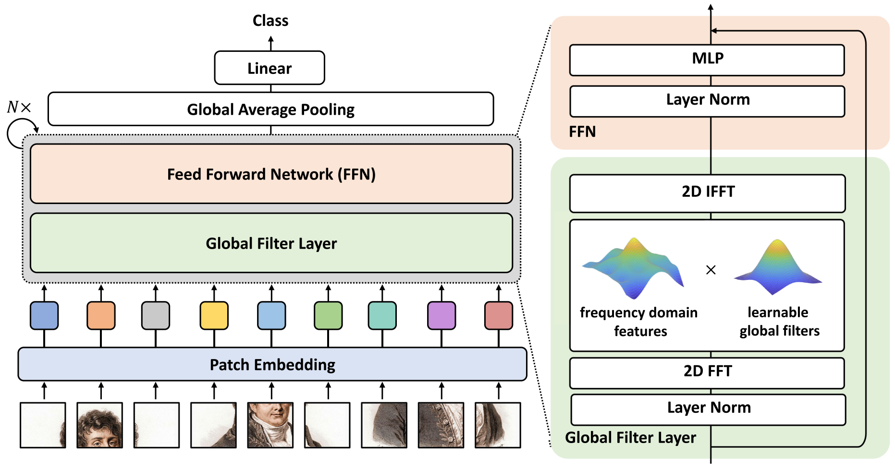
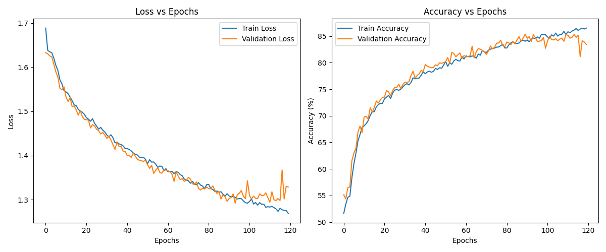
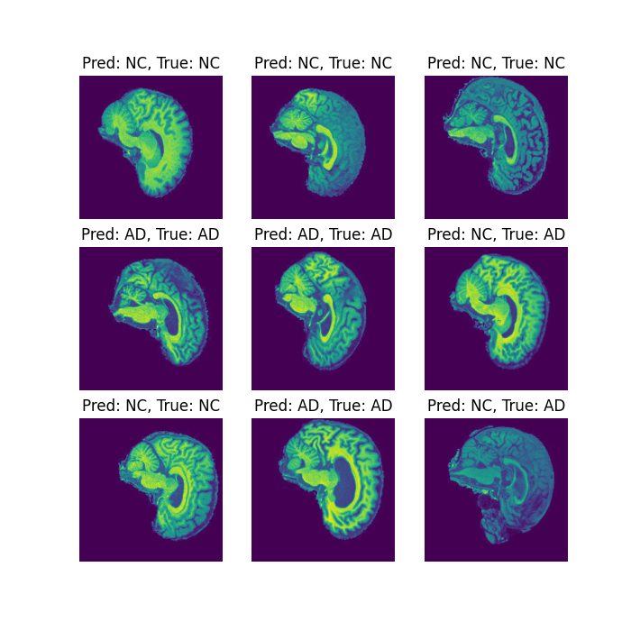
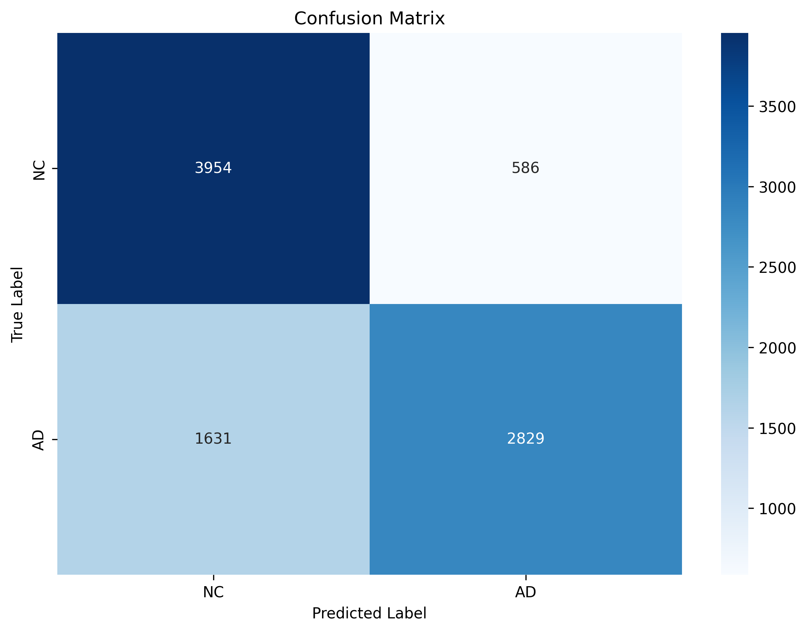
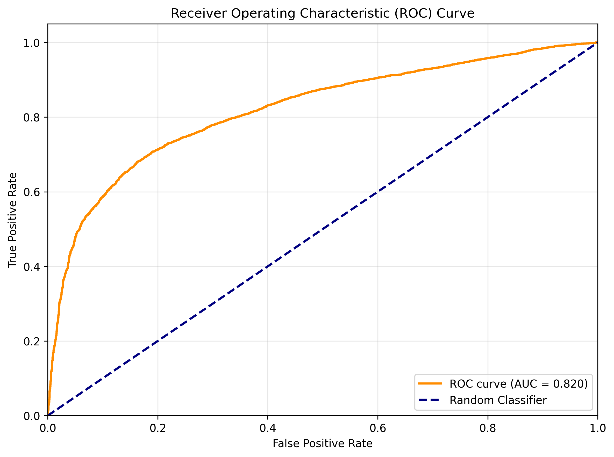
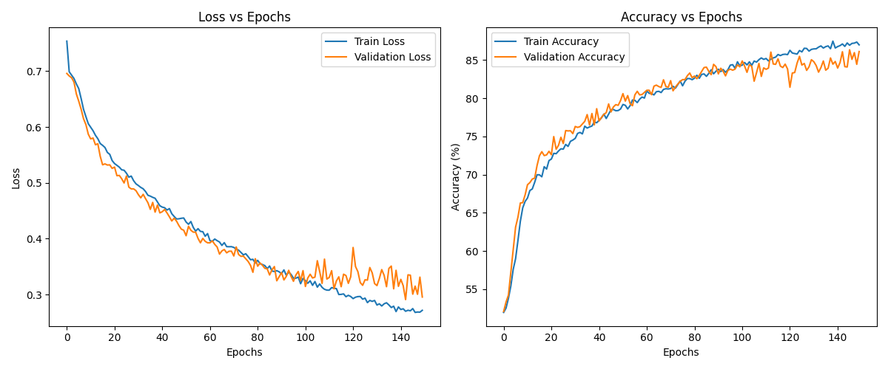
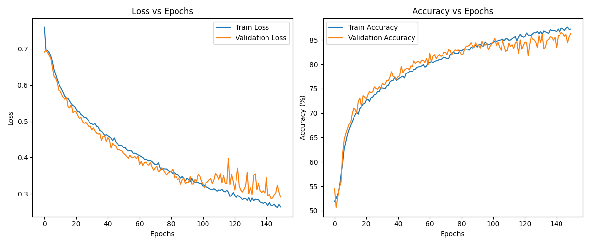

# **Classify Alzheimer’s disease of the ADNI brain data using GFNet**
**Author**: Wenyue Guo (s4908581)  
**Project Number**: 8  
**Difficulty level**: Hard  
**Course**: COMP3710 - Pattern Recognition and Analysis  
**Submission Date**: 30 October 2025  
**Version**: v1.0.0  
**License**: Apache License 2.0  
**License URL**: https://www.apache.org/licenses/LICENSE-2.0  
  
**Keyword**: Alzheimer's Disease, ADNI Dataset, GFNet, Medical Image Classification, Deep Learning  

## **Project Overview**
Alzheimer's disease is a progressive neurodegenerative disorder characterized by cognitive decline, memory loss, and behavioral changes. Early and accurate diagnosis is crucial for timely intervention and treatment planning. This project addresses the challenging task of Alzheimer's disease classification from brain MRI scans. It focuses on distinguishing between Alzheimer's disease (AD) and Cognitive Normal (CN) subjects. The primary objective of this project is to develop and implement a deep learning framework ​​based on GFNet (Global Filter Network) for automated classification of Alzheimer's disease using structural MRI data from the Alzheimer's Disease Neuroimaging Initiative (ADNI) dataset. GFNet's innovative use of global filters in the frequency domain provides enhanced capability to capture long-range dependencies in medical images, making it well-suited for​ analyzing complex neuroanatomical patterns associated with Alzheimer's pathology. The implemented GFNet-based solution achieves a ​​test accuracy of **75.83%**, demonstrating the model's ability to learn meaningful representations from brain MRI data. 

## **Model Architecture**
### **Model Description**
I adopted GFNet for the classifition task. The architecture is shown in the figure (Rao, 2023):

GFNet (Global Filter Networks) represents an innovative vision architecture. It introduces a frequency-domain approach to capture global context more efficiently, making it particularly suitable for medical image analysis tasks. Its parts are as following:

Patch Embedding: GFNet divides the input image into non-overlapping patches of size *H* × *W*. Each patch is flattened into a vector with a dimension of *D*. This process enables local feature capture while reducing computational complexity.

Global Filter Layer: GFNet replaces the self-attention layer in ViTs with three key operations. First is a 2D discrete Fourier transform that converts spatial features to frequency domain. Second is an element-wise multiplication between frequency-domain features and learnable global filters. Third is 2D inverse Fourier transform, which transforms the data back to spatial domain. The overall time complexity​​ of this operation is O(L log L)

FFN (Feed Forward Network): The output tokens from the Global Filter Layer are processed by a Feed forward network. The process contains MLP (Multilayer Perceptrons) with layer normalization. This component applies non-linear transformations to refine the extracted features and enhance the model's representational capacity.

Global Average Pooling and Linear Classifier: The final stage aggregates processed tokens through global average pooling, and produces a compact feature vector that summarizes the entire input. This vector then passes through a linear classifier that outputs probability scores for each disease category (Alzheimer's vs. Cognitive Normal).

In the architecture, a block contains global filter layer and FFN. For each epoch, data goes patch embedding, then passes *N* sequential blocks, and finally goes to global average pooling and linear classfier. The block number *N* is adjustable for different tasks. 

### **Why choose GFNet**
Compared with traditional CNNS and ViT, GFNet has the following advantages:
- **Computational efficiency**: FFT operations are more efficient than self-attention.
- **Global receptive Field**: Frequency domain operations can capture the global dependencies of the entire image.
- **Medical image applicability**: Suitable for analyzing the global pattern of brain structure.

## **Data Loading and Preprocessing**
### **The ADNI Dataset**
The preprocessed dataset is downloaded from `/home/groups/comp3710/ADNI/AD_NC`. It contains a total 30,520 brain MRI images. They are shown in grayscale. The images are divided into training set and testing set. In each folder, the images are labeled into two categories, Alzheimer's Disease (AD) and Cognitive Normal (NC). The number of each label are listed below:

| | Alzheimer's Disease | Cognitive Normal |
|-------|-------|-------|
| Training set | 10,400 | 11,120 |
| Testing set | 4,460 | 4,540 |

The distribution of the dataset shows that the number of the two categories are similar. There is no need to consider class imbalance. 
### **Data Loading**
The dataset is downloaded from Rangpur HPC. The path is as following:

`/home/groups/comp3710/ADNI/AD_NC`

The `ADNIDataset` class is able to load both training set and testing set. The images are labeled by the class as following:
- 1 is for Alzheimer's Disease (AD)
- 0 is for Normal Control (NC)

When the function `__getitem__` is called, an grayscale image and its corresponding label will be retrieved by index. When loading the training set, it will be split into 80% training set and 20% validation set. This is to improve the generalization ability of the model. This percentage of the split is also commonly used in other tasks.

### **Data Preprocessing and Augmentation**
In the training set, the data is preprocessed and augmented as following:

- RandomRotation: Applies random rotations at a small angle (-10 degree - 10 degree). It improves model robustness to orientation variations in MRI scans
- RandomResizeCrop: Randomly crops and resizes images to 224×224. It simulates different anatomical views and scales and helps learn features from various regions
- ColorJitter: Randomly adjusts brightness (80-120% of original). It improves robustness in different light conditions
- ToTensor: Converts PIL image to PyTorch tensor
- Normalize: Standardizes pixel intensities using dataset-specific parameters. It accelerates convergence in training

The testing set is preprocessed and augmented as following:
- Resize: Resizes image to 256×256 (maintaining aspect ratio). It standardizes input size before center cropping
- CenterCrop: Crops central 224×224 region in order to focuses on most clinically relevant brain regions.
- ToTensor: Converts PIL image to PyTorch tensor
- Normailize: Uses identical parameters to maintain data distribution consistency
## **Training and Testing**
### **Training Result**
The configurations are shown in the table below:
| Category | Hyperparameter | Value | Description |
|-------|-------|-------|-------|
| **Model architecture** | Network Depth | 8 layers | number of blocks |
| **Training Parameters** | Batch Size | 32 | Samples per iteration |
|  | Total Epochs | 120 |  |
|  | Initial Learning Rate | 0.001 |  |
| **Optimizer** | Optimizer Type | Adam |  |
| **Learning Rate Scheduler​** | ​Scheduler Strategy | CosineAnnealingWarmRestarts |  |
|  | $T_0$ | 10 | Number of epochs for first restart |
|  | $T_{mult}$ | 2 | Multiplication factor for $T_i$ after restart |
|  | Minimum Learning Rate | 1e-6 | Lower bound of learning rate |
| **Loss function** | Loss Type | LabelSmoothCE | Label Smoothing Cross Entropy |
|  | Smoothing Factor | 0.1 | Degree of label smoothing |
| **Regularization**​ | Early Stopping Patience | 10 | Epochs to wait before stopping (currently disabled) |
| **Data Loading** | Number of Workers | 4 | Parallel processes to accelerate data loading |

The result of training is shown in the figure:

Result shows that the training accuracy can achieve over 85%, and the validation accuracy can achieve over 80%. The training loss first decreasely rapidly, and then the ​​rate of decrease gradually slows. The validation loss follows a similar trend. The gap between training loss and validation loss is small and remains stable in the majority training process. This shows that the model has a good generalization capability and robustness. However, the gap increases in the final stage of training. This is probably because the model experienced slight overfitting in the later stage of training. The reason is that the learning rate may be too low in the later stage, and the number of epochs is too high, leading to overfitting. A possible solution is to reduce number of epochs. In my code, I added early stopping for improvement. The early stopping is disabled to show the whole training process, the model stops at epoch 104 in another trial. Despite this, the model can effectively learn from the training data and maintains its performance in validation data.

### **Testing Result**
The test data are from testing set. The accuracy of the model is **75.83%**. The result indicates that the model has a reasonable performance when meeting unseen data, demonstrating good generalization ability. 

The visualization of the performance are shown below.
#### **Actual label vs. Predicted label**
The output plot do_prediction() function is shown below. The function randomly samples nine images from the test set and do prediction to the images. The output compares the predicted labels and the true labels of each sampled image.

Result shows that 7 in 9 labels are predicted correctly. This shows a good prediction accuracy.
#### **Confusion Matrix**
The plot below shows the confusion matrix of the testing set.

For the NC category, which represents healthy people (without AD), 3,954 out of 4,540 samples are correctly recognized, and 586 out of 4540 are misjudged as AD. For the AD category, which represents patients (with AD), 2,829 out of 4,460 are correctly recognized as patients, and 1,631 out of 4,460 missed diagnosis. The false negatives​​ (missed diagnoses) of patients is the main types of errors. For every 3 AD patients missed, only 1 healthy person is misdiagnosed. This shows that the model adopts conservative diagnostic strategies. This approach ​​avoids unnecessary treatment​​ but may delay intervention for some patients.

The sensitivity (true positive rate) of the matrix is calculated as below:

$$TPR = \frac{TP}{TP + FN}$$

where TP represents the number of samples correctly identified as AD, and FN represents the number of AD samples misjudged as NC. The specificity (true negative rate) is calculated as below:

$$TNR = \frac{TN}{FP + TN}$$

where TN represents the number of samples correctly identified as NC, and FP represents the number of NC samples that are misjudgedas as AD. The model's value of sensitivity is **63.4%**, and the value of specificity is **87.1%**. The model has a high specificity, indicating that the model is very cautious and rarely misdiagnoses healthy individuals as having AD. But the model has a moderate sensitivity, indicating it will miss a considerable number of true AD patients. The result indicates that the model adopts a ​​conservative diagnostic strategy that prioritizes specificity.

#### **ROC Curve**
The plot below shows the ROC (Receiver Operating Characteristic) curve. 

The X-axis value is $1-TNR$, and the y-axis value is $TPR$. The diagonal is the performance benchmark of randomly guess. The curve first rise rapidly and then smooth, showing the model has ​​higher specificity than sensitivity. The result is the same as the result in previous section. AUC (Area Under Curve) score is the area under the ROC curve. The larger the value, the better performance the model has. The AUC score of the testing set is **0.820**. This shows that the model has a good discriminatory ability and is significantly better than random guessing.
## **Design choices**
This part are some comparisons I made to search for potential model improvement.
### **Model Architecture**
1. I tried to change the number of blocks to remain accuracy while improving training efficiency.

| Number of Blocks| 8 | 10 |
|-------|-------|-------|
| Test Accuracy | 74.94% | 75.31% |

The result shows that with an increased number of blocks, efficiency can be improved. However, training the 8-block architecture took approximately 6 hours, compared to about 7.5 hours for the 10-block version. Considering the effeciency, I think 8 blocks is good enough for the task.

2. I also tried to apply residual connection to an individual block in order to increase stability.
The below table shows the comparison of two models.

| | Block without residual connection | Block with residual connection |
|-------|-------|-------|
| Test Accuracy | 75.30% | 74.37% |

The below figure show the training and validation result of initial version.

The below figure show the training and validation result of residual connection version.

Result shows that the stability of the two models is almost the same, but the test accuracy of block without residual connection is higher than the other one. Remaining the initial architecture is a better choice. 

I have also noticed that there are more complex architectures from different papers. Such as the GFNetPyramid architecture from [1] and the architecture with Dynamic Filter Former (DFFormer) from [3]. But these architectures takes much more time to train. I will try these models after submitting the report.

### **Loss function**
I applied to different loss functions in training. Below are the details of the two loss function.

- Loss function 1: Standard Cross Entrophy
This loss function is PyTorch's default classification loss that directly maximizes true class probability. The loss $L_n$ is calculated as below:

$$L_n = -w_{y_n}× \log \frac{exp(x_{n,y_n})}{\sum_{c=1}^{C}exp(x_{n,c})}$$

where $x$ is the x is the output of the model (logits), $y$ is the target category index, $w_{y_n}$ is the weight of class ${y_n}$, $C$ is the number of classes. $N$ is the *n*th sample.

- Loss function 2: Label Smooth Cross Entrophy
This custom loss function implements ​​label smoothing​​. The idea of label smoothing is that do not consider the probability of the correct category as 1 and that of other categories as 0. Instead, slightly reduce the confidence level of the correct category and give some weight to other categories to enhance the generalization ability of the model, avoid overfitting or overconfidence.

- It represents the probability mass redistributed from true class. The loss $L_n$ is calculated as below.

$$L_n = (1 - \epsilon) \cdot \left[-\log(\frac{exp(x_{n,y_n})}{\sum_{c=1}^{C}exp(x_{n,c})})\right] + \epsilon \cdot \left[-\frac{1}{C} \sum_{c=1}^C \log(p_j) \right]$$

where $x$ is the x is the output of the model (logits), $y$ is the target category index, $w_{y_n}$ is the weight of class ${y_n}$, $C$ is the number of classes. $N$ is the *n*th sample, $p_j$ is the predicted probability of class $j$, $\epsilon$ is the smoothing parameter that controls the degree of label smoothing.

In the training, the smoothing parameter​​ set to 0.1. The table below shows the comparison of the two loss functions.

| | Loss function 1 | Loss function2 |
|-------|-------|-------|
| Test Accuracy | 75.30% | 75.72% |

Result shows that the accuracy of label smooth CE is slightly higher than standard CE. This indicates that the performance of these two loss functions is at the same level.
### **Learning rate**
I tried four different learning rates to find the best training configuration for the task. The table below shows the comparison:

| Learning rate | Accuracy |
|-------|-------|
| 0.01 | 73.83% |
| 0.005 | 75.37% |
| 0.001 | 75.83% |
| 0.0005 | 75.44% |

Result shows that the model achieves the highest prediction accuracy when learning rate is set to 0.001.
### **Optimizer**
I tried two different optimizers. Below is a comparison of the two.

Optimizer1: Adam (default configuration)   
Optimizer2: AdamW (weight_decay=1e-4, betas=(0.9, 0.999), eps=1e-8)   

| | Optimizer1 | Optimizer2 |
|-------|-------|-------|
| Test Accuracy | 75.38% | 74.31% |

In the two optimizers, weight decay is coupled with gradient update in Adam, while weight decay is decoupled from gradient update in AdamW. Result shows that Adam performs better than AdamW. 

### **Scheduler**
I tried two different scheduler configurations. Below is a comparison.

Config1:  CosineAnnealingWarmRestarts (T_0=10, T_mult=2, eta_min=1e-6)
Config2:  CosineAnnealingWarmRestarts (T_0=20, T_mult=2, eta_min=1e-7)

| | Config1 | Config2 |
|-------|-------|-------|
| Test Accuracy | 75.38% | 74.89% |

In the two configurations, configuration 1 has a shorter cycle length and a larger minimum learning rate, while configuration 2 has a longer cycle length and a smaller learning rate. Result shows that configuration 1 has a better performance than configuration 2. 

## **Conclusion**
This project successfully implemented a GFNet-based deep learning framework for Alzheimer's disease classification using ADNI brain MRI data. The model achieved a test accuracy of **75.83%** with an AUC score of **0.820**, demonstrating the effectiveness of frequency-domain global filtering for medical image analysis.

### **Key Achievements:**
- **Baseline Performance**: The relatively simple GFNet architecture demonstrated reasonable capability in distinguishing AD from NC cases, serving as a good starting point for this challenging medical image classification task
- **Architecture Efficiency​​**: The 8-block GFNet configuration balanced computational efficiency with performance, making it suitable for initial exploration of this problem domain.
- **Conservative Diagnosis**: The model exhibited high specificity (87.1%), indicating its potential value as a preliminary screening tool despite moderate sensitivity

### **Limitations and Future Work:**
- **Model Complexity**: The current architecture represents a simplified implementation of GFNet. Future work could explore deeper architectures (e.g., GFNet-Pyramid) or hybrid models combining GFNet with convolutional layers
- **Performance Enhancement**: The 75.83% accuracy, while reasonable for a baseline, leaves significant room for improvement through techniques such as:
    - Advanced data augmentation specific to medical images
    - Larger dataset for improved training
    - Ensemble methods combining multiple architectures
- **Sensitivity Improvement**: Current sensitivity of 63.4% needs enhancement for clinical deployment

Despite its simplicity, this implementation demonstrates the feasibility of GFNet for Alzheimer's disease classification and provides a foundation for more sophisticated approaches.  The conservative diagnostic pattern (high specificity) makes it particularly suitable for initial screening applications where false positives should be minimized.

The project highlights both the challenges of medical image analysis and the potential of frequency-domain approaches like GFNet for capturing global pathological patterns in neurodegenerative diseases.  Future iterations will focus on architectural enhancements and advanced training strategies to improve sensitivity while maintaining the model's clinical safety profile.

## **Dependencies and Reproducibility**
### **Dependencies**
- `torch>=1.9.0`
- `torchvision>=0.10.0`
- `Pillow>=8.0.0`
- `matplotlib>=3.3.0`
- `scikit-learn>=0.24.0`
- `seaborn>=0.11.0`
- `timm>=0.6.0`
- `numpy>=1.19.0`

### **Code Running Method**
For local machine (The code is tested on local machine):
1. Download and unzip all files to the same folder
2. Download the dataset from Rangpur/outer resource
3. Download all required dependencies
4. Change the path to dataset folder
5. Run train.py
6. Run predict.py

### **References**
[1] Y. Rao, W. Zhao, Z. Zhu, J. Zhou and J. Lu, "GFNet: Global Filter Networks for Visual Recognition," in IEEE Transactions on Pattern Analysis and Machine Intelligence, vol. 45, no. 9, pp. 10960-10973, 1 Sept. 2023.

[2] raoyongming, "GFNet", 2021. [Online]. Available: https://github.com/raoyongming/GFNet [Accessed: Oct. 29, 2024]

[3] Tatsunami, Y., & Taki, M. (2024). FFT-Based Dynamic Token Mixer for Vision. Proceedings of the AAAI Conference on Artificial Intelligence, 38(14), 15328-15336.

[4] PyTorch, "CrossEntropyLoss — PyTorch 2.9 documentation," 2024. [Online]. Available: https://pytorch.org/docs/stable/generated/torch.nn.CrossEntropyLoss.html 

[5] GavinSaiun, "GFNet-Alzheimer-Detection", 2025. [Online]. Available: https://github.com/GavinSaiun/GFNet-Alzheimer-Detection [Accessed: Oct. 29, 2024]

[6] OpenAI. (2023). ChatGPT (Mar 14 version) [Large language model]. https://chat.openai.com/chat
